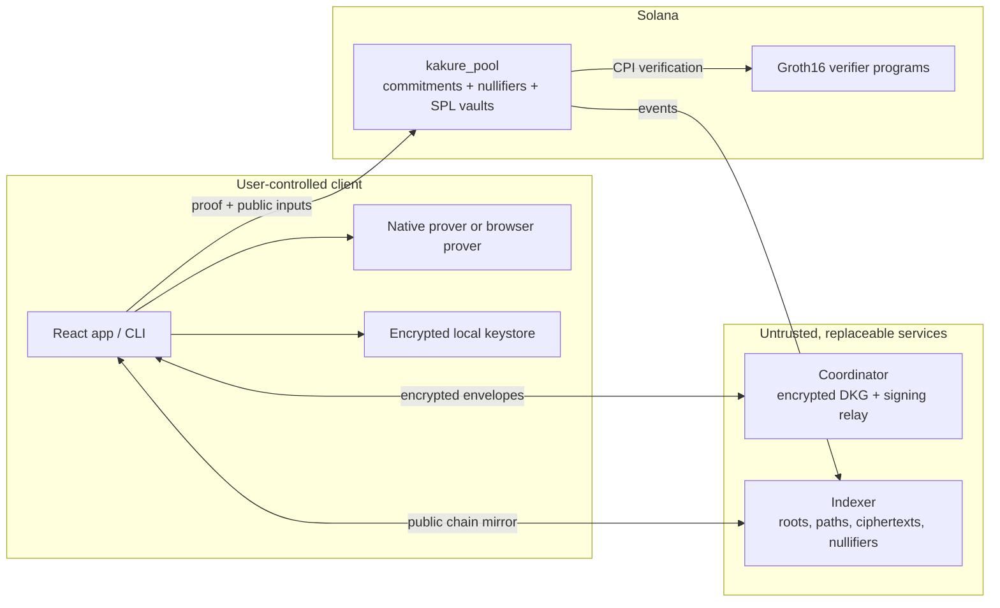

# Kakure Prime (隠れ Prime)

<p align="center">
  <strong>Confidential prime brokerage for tokenized equities on Solana.</strong><br />
  Shield positions, require threshold approval, settle privately, and disclose only to an authorized audit quorum.
</p>

<p align="center">
  <a href="https://kakure-prime.vercel.app/"></a>
  <a href="https://explorer.solana.com/address/HPzs68TncDWTHocTZv5ekvpMwDjcx4PeHLoTedwBsccF?cluster=devnet"></a>
  <a href="./LICENSE"></a>
</p>

> [!WARNING]
> Kakure Prime is a pre-release research prototype. It is unaudited, uses development proving parameters, and is intended only for localnet/devnet demonstrations. Do not use it with real funds or securities.

## Start here

| Experience | Link |
|---|---|
| Live product | [kakure-prime.vercel.app](https://kakure-prime.vercel.app/) |
| 60-second judge walkthrough | [Launch guided demo](https://kakure-prime.vercel.app/#/demo) |
| Pitch video | [Watch the pitch](https://kakure-prime.vercel.app/pitch-video.html) |
| Technical walkthrough | [Watch the technical demo](https://kakure-prime.vercel.app/demo-video.html) |
| Stocklana submission brief | [SUBMISSION.md](./SUBMISSION.md) |
| Build/originality disclosure | [STOCKLANA.md](./STOCKLANA.md) |

The fastest judging path is: open the guided demo, select an official PreStocks asset, inspect the live market-risk gate, advance a 3-of-5 private settlement, then open the linked Meteora pool and finalized trade on Solana Explorer.

## The problem

Tokenized equities are programmable, global, and fast—but their ownership graph is public. A fund that accumulates a position reveals its strategy. A company that distributes equity reveals recipients and amounts. A multisig protects keys, but still publishes the signer set, threshold, balances, and every movement.

Kakure Prime gives funds, DAOs, family offices, and global teams a confidential settlement layer:

- **Shielded positions:** amounts, assets, recipients, and signer structure are hidden behind commitments.
- **Threshold custody:** dealerless FROST DKG creates a configurable `t-of-n` portfolio; no single signer holds the custody key.
- **Private settlement:** Groth16 proofs enforce ownership, value conservation, and quorum approval on-chain.
- **Selective auditability:** notes are additionally encrypted to a rotatable committee key, requiring an authorized quorum to disclose.
- **Self-custody:** proofs are generated by the user; the coordinator and indexer are not trusted with funds or plaintext positions.

## What is real today

| Surface | Status | Evidence |
|---|---|---|
| Noir circuits + Groth16 proving | Working on localnet | Seven circuits, native prover, verifier programs, negative tests |
| Solana shielded pool | Deployed on devnet | [Program `HPzs…sccF`](https://explorer.solana.com/address/HPzs68TncDWTHocTZv5ekvpMwDjcx4PeHLoTedwBsccF?cluster=devnet) |
| FROST custody and encrypted coordination | Working | Dealerless DKG, threshold signing, encrypted relay |
| Token-2022 routing | Working in code/localnet | Asset-program validation and deposit/withdraw routing |
| PreStocks policy rail | Live in judge demo | Official API allowlist and ±15% token-to-mark mandate |
| Pyth settlement-risk rail | Live when entitled | Server-only broker; freshness and confidence enforcement |
| Meteora DBC | Traded on devnet | [Pool](https://explorer.solana.com/address/58Hx2oENZDdiZHqsrxbZRNypMQKpt4rGbLGEXy8sTbcW?cluster=devnet) · [finalized buy](https://explorer.solana.com/tx/57ro5JMwkSZaMM15DjBrCXkUoxKtVvfRkJbYAVRHZzz6TKGdTivqKvDiLsGh22FroEBBbXrdQzjuRw6Cr368y1to?cluster=devnet) |
| Hosted judge walkthrough | Live | Sponsor/deployment evidence is live; the five settlement clicks are intentionally simulated |
| Zero-install browser proving | Integrated; deployment artifacts required | Deposit/withdraw use the real worker-based Go/gnark WASM prover with persistent artifact caching and prepared-circuit reuse; a deployment must stage its matching `.ccs`/`.pk`/WASM assets |

The full cryptographic flow runs end to end on a local validator. The hosted walkthrough is designed for reliable judging without an 80-second proof wait or a local prover installation; it labels its simulated settlement clicks in the UI.

## Sponsor integrations

### PreStocks — official-only private-market settlement

- The official PreStocks API is the allowlist; no competing pre-IPO token is integrated.
- Contract addresses must be valid Solana keys and returned assets must satisfy the app's policy checks.
- Live token and mark prices feed a ±15% mandate; out-of-policy settlement is blocked before shielding.
- The selected official contract and policy decision remain visible to judges.

### Pyth — risk enforcement, not a decorative price card

- Kakure discovers the canonical `Crypto.AAPLX/USD` feed.
- An authenticated server-side broker keeps `PYTH_API_KEY` out of the browser.
- Settlement rejects prices older than 30 seconds or confidence intervals wider than 100 bps.
- If the account is not entitled to AAPLx, the app transparently uses live `Crypto.SOL/USD` as a cross-market health gate rather than fabricating an equity price.

### Meteora DBC — a traded shielded-equity receipt

- Official SDK configuration with a 100 bps discovery fee decaying to the 25 bps protocol minimum over 24 hours.
- DAMM v2 graduation with 10% permanently locked migration liquidity.
- Real devnet configuration, receipt mint, pool, quote, and finalized buy transaction.
- The curve is intended for price discovery around a transferable receipt representing shielded equity exposure—not a generic memecoin launch.

## Architecture



### Privacy model

Funds are represented as UTXO-style notes. Each note commits to its asset, value, owner, randomness, and audit ciphertext. The pool stores only commitments, Merkle roots, and spent nullifiers. A valid proof shows that a spend owns an unspent note, conserves value, and—when group-owned—contains a valid FROST quorum signature.

The coordinator sees encrypted envelopes, session identifiers, and timing. The indexer sees public program events and encrypted note payloads. Neither service is trusted to authorize a spend or learn plaintext positions.

## Devnet evidence

| Artifact | Address / transaction |
|---|---|
| Kakure pool | [`HPzs68TncDWTHocTZv5ekvpMwDjcx4PeHLoTedwBsccF`](https://explorer.solana.com/address/HPzs68TncDWTHocTZv5ekvpMwDjcx4PeHLoTedwBsccF?cluster=devnet) |
| Demo verifier | [`37K2Nhpuh2r3xv6gZ9yfA8gPpEpvDXfLkgkK3YmdWVHT`](https://explorer.solana.com/address/37K2Nhpuh2r3xv6gZ9yfA8gPpEpvDXfLkgkK3YmdWVHT?cluster=devnet) |
| Meteora DBC config | [`8wqCNyoxQMUGRJwXngG2wxVLzqduTazi2nDjcuoCqbFT`](https://explorer.solana.com/address/8wqCNyoxQMUGRJwXngG2wxVLzqduTazi2nDjcuoCqbFT?cluster=devnet) |
| Meteora pool | [`58Hx2oENZDdiZHqsrxbZRNypMQKpt4rGbLGEXy8sTbcW`](https://explorer.solana.com/address/58Hx2oENZDdiZHqsrxbZRNypMQKpt4rGbLGEXy8sTbcW?cluster=devnet) |
| Shielded-equity receipt | [`Eqi8f5wf2fDWKriZUGC8qRS9ueYwhf37LDpZupaSbfJ8`](https://explorer.solana.com/address/Eqi8f5wf2fDWKriZUGC8qRS9ueYwhf37LDpZupaSbfJ8?cluster=devnet) |
| Finalized DBC buy | [`57ro…1to`](https://explorer.solana.com/tx/57ro5JMwkSZaMM15DjBrCXkUoxKtVvfRkJbYAVRHZzz6TKGdTivqKvDiLsGh22FroEBBbXrdQzjuRw6Cr368y1to?cluster=devnet) |

The deployed verifier is deliberately labelled as a **demo verifier**. Real Groth16 verification is exercised in the local-validator path; the demo verifier must never custody real assets.

## Repository map

| Path | Purpose |
|---|---|
| `circuits/` | Seven Noir circuits, shared constraints, KATs, and build pipeline |
| `programs/kakure_pool/` | Native Solana pool, vault routing, commitment tree, nullifiers, compliance key |
| `programs/mock_verifier/` | Explicitly test/demo-only verifier |
| `packages/sdk/` | Notes, scanning, FROST/DKG, threshold decryption, transaction builders |
| `packages/prover/` | Native witness generation, Groth16 proving, proof compression |
| `packages/prover-wasm/` | Browser-prover build work and benchmarks |
| `packages/indexer/` | Solana event follower, Merkle mirror, witness/nullifier HTTP API |
| `packages/coordinator/` | Encrypted relay for DKG and threshold-signing sessions |
| `packages/helper/` | Local native-prover bridge for the web treasury flow |
| `packages/cli/` | Group, deposit, proposal, signing, execution, and audit commands |
| `apps/web/` | React product, judge demo, treasury, claim, and audit surfaces |
| `tests-litesvm/` | Program-level integration tests |
| `e2e/` | Full localnet flow with real proofs and negative cases |

## Run it locally

### Prerequisites

- Linux x86_64 or WSL2
- Node.js 22 and pnpm 10
- Rust, Solana CLI, Go, Noir, and Sunspot
- Approximately 8 GB RAM and 5 GB free disk

```bash
git clone https://github.com/unspecifiedcoder/kakure-prime.git
cd kakure-prime
bash scripts/bootstrap.sh

# Real local-validator protocol flow: DKG → deposit → private transfer → withdraw
just e2e-scenario
```

Run the web stack:

```bash
just helper-dev   # native proving bridge; prints a short-lived bearer token
just web-dev      # opens the React app on localhost
```

Phantom connection requires Chrome or Brave with the Phantom extension enabled. The Codex in-app browser and other extensionless embedded browsers cannot inject Phantom.

## Build and test

```bash
pnpm install --frozen-lockfile
pnpm build
pnpm test

just build-circuits
just build-programs
just verify-programs-reproducible
just e2e-scenario
```

`programs/deploy/*.so` contains the binaries loaded by the local validator. `just verify-programs-reproducible` rebuilds them in a scratch directory and compares SHA-256 hashes so stale or modified binaries are detectable.

## Security model

### Enforced today

- Note ownership and value conservation
- Nullifier uniqueness and double-spend prevention
- Threshold approval inside the multisig circuits
- Binding of public inputs to the proof
- Asset-program validation for SPL Token and Token-2022 routing
- Threshold-encrypted compliance payloads with committee-key rotation

### Trusted or incomplete today

- Development Groth16 setup parameters
- Unaudited circuits, programs, and Sunspot toolchain
- A demo verifier on the public devnet deployment
- A local helper for treasury-side proving
- A browser prover stub for zero-install deposits and withdrawals
- The anonymity set of the active pool

## What remains to build

### P0 — complete the undeniable hosted transaction

- [ ] Replace `WasmProver` with the real browser WASM prover for zero-install deposit and withdrawal.
- [ ] Deploy the seven production verifier programs to devnet and point the pool at them instead of the demo verifier.
- [ ] Execute and record a complete Phantom-driven devnet path: connect → deposit → private settlement → withdrawal, with Explorer links in the UI.
- [ ] Add GitHub Actions for workspace tests, web build, Rust tests, reproducible program binaries, and secret scanning.

### P1 — sponsor and production hardening

- [ ] Obtain direct Pyth entitlement for the canonical AAPLx feed so the live gate no longer needs the disclosed SOL fallback.
- [ ] Add a real PreStocks asset settlement transaction, not only official catalog/policy enforcement.
- [ ] Exercise the DBC lifecycle through graduation/migration; evaluate mainnet only after security review.
- [ ] Audit Token-2022 extension combinations per supported asset and add property/fuzz tests.
- [ ] Add service health checks, RPC failover, metrics, alerts, and an indexer-lag indicator in the UI.

### P2 — production readiness and product depth

- [ ] Multi-party trusted-setup ceremony and independent circuit/program audit.
- [ ] Multithreaded browser proving and proof-artifact caching.
- [ ] Hardware-wallet testing, recovery UX, and encrypted cross-device treasury backup.
- [ ] Scheduled distributions, multi-asset batches, policy templates, and accountant exports.

## Originality disclosure

Kakure Prime transparently builds on **Kakure**, an Apache-2.0 project by the same author that predates Stocklana. The pre-existing foundation includes the base ZK circuits, FROST custody, pool program, SDK, and private-payment flow. Stocklana work adds Token-2022 equity compatibility, xStocks presets, the official-only PreStocks policy rail, the Pyth settlement-risk gate and server broker, the Meteora DBC receipt/configuration/pool/trade, hosted infrastructure, and the equity-focused judge experience. See [STOCKLANA.md](./STOCKLANA.md) for the detailed disclosure.

## License

Apache-2.0. See [LICENSE](./LICENSE).
