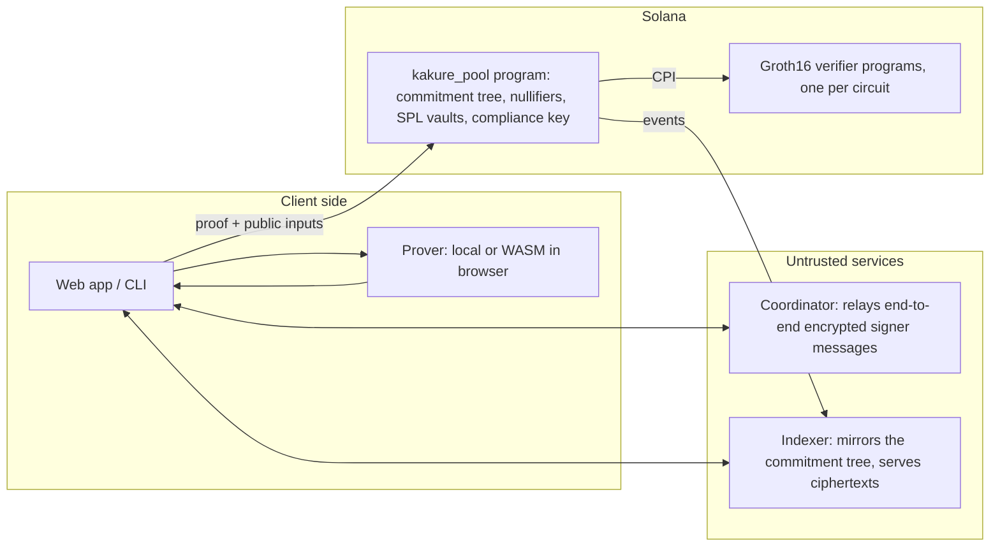

# Kakure Prime (隠れ Prime)

**Confidential treasury and settlement for tokenized equities on Solana.**
Kakure Prime lets a fund, DAO, or global team custody and distribute tokenized stock positions under threshold approval without publishing its portfolio, recipients, signer graph, or strategy to the world.

> **Stocklana build.** This repository is a transparent continuation of the open-source Kakure privacy protocol. The Stocklana work adds Token-2022 support for assets such as xStocks, a live equity-market surface, verified Solana mint presets, and a focused private-markets workflow. See [STOCKLANA.md](./STOCKLANA.md) for the submission brief and originality disclosure.

> Status: **pre-release.** The core protocol runs end to end on a local validator with real zero-knowledge proofs. Not audited. Dev trusted setup only. Do not use with real funds or securities.

---

## Why

Every treasury on Solana today is public. A DAO that pays 50 contributors publishes 50 salaries; a fund that rebalances publishes its book. Multisigs add safety, not privacy — the signer set, the threshold and every payment are on-chain for anyone to read.

Kakure keeps the safety and removes the exposure:

- **Private group custody.** A t-of-n signing group (FROST threshold signatures, dealerless DKG) owns shielded notes. The threshold check happens *inside* the zero-knowledge proof, so a group-owned note is indistinguishable from a single-owner note on-chain.
- **Private payouts.** Batch payments to many recipients; each recipient gets a claim link and withdraws to any wallet, with no install.
- **Built-in auditability.** Every note is also encrypted to a rotatable *committee* key: a quorum of auditors can decrypt when legitimately required; no single party can. Confidentiality for the business, accountability for the regulator.
- **Trust-minimised.** Proofs are generated on the user's own machine or in the browser and verified on-chain. No MPC network, no hardware enclave, no hosted prover in the trust path.

## How it works



- **Notes.** Funds live as UTXO-style notes: a commitment (Poseidon2 hash of the note) in a depth-32 Merkle tree. Spending a note requires a proof of ownership and publishes a nullifier that prevents double-spends.
- **Circuits** (Noir): `deposit`, `transfer`, `withdraw` for single keys; `transfer_multisig`, `split_multisig`, `join_multisig`, `withdraw_multisig` for groups. The group circuits verify a FROST (Schnorr over BabyJubJub) signature as a constraint.
- **Proofs.** Circuits compile to Groth16 (BN254) via [Sunspot](https://github.com/reilabs/sunspot); the pool program decompresses the 192-byte proof and verifies it through a CPI to a generated verifier program. Every instruction fits in one Solana transaction (≤1232 bytes) and under 1.4M CU.
- **Tree.** Lean incremental Merkle tree hashed with Poseidon (v1) so the program can append using Solana's native `sol_poseidon` syscall; everything else (commitments, nullifiers, keys, signatures) uses Poseidon2 off-chain.
- **Compliance.** The committee public key is injected on-chain into every proof's public inputs; notes are wrapped to it with threshold ECDH.

## Repository layout

| Path | What |
|---|---|
| `circuits/` | Noir circuits, shared library, KATs, build pipeline (`just build-circuits`) |
| `programs/kakure_pool/` | The on-chain program (native `solana-program`, borsh instructions) |
| `programs/mock_verifier/` | Test-only verifier |
| `tests-litesvm/` | Program integration tests (litesvm) |
| `packages/sdk/` | Keys, notes, scanning, FROST/DKG, threshold decryption, transaction building |
| `packages/prover/` | Witness generation + Groth16 proving via Sunspot; proof compression |
| `packages/prover-wasm/` | The prover compiled to WebAssembly for in-browser proving |
| `packages/indexer/` | Chain follower + HTTP API (roots, Merkle paths, ciphertexts, nullifiers) |
| `packages/coordinator/` | Encrypted message relay for DKG and signing sessions |
| `packages/helper/` | Local prover service for the web app (treasury side) |
| `packages/cli/` | `kakure` command line: groups, deposits, proposals, signing, execution |
| `apps/web/` | Web app: treasury (create, fund, pay people), recipient claim page, audit view |
| `e2e/` | Localnet end-to-end scenario (DKG → deposit → 3-of-5 transfer → withdraw → negative cases) |
| `docs/superpowers/` | Design specs, implementation plans, review findings |

## Quick start

Prerequisites: Linux x86_64 (or WSL2), ~8 GB RAM, ~5 GB disk.

```bash
git clone https://github.com/unspecifiedcoder/kakure.git
cd kakure
bash scripts/bootstrap.sh      # toolchain (Noir, Sunspot, Solana, Go, Rust, Node) + prebuilt artifacts

just e2e-scenario              # full protocol on a local validator (≈3 min)
```

Run the web app locally:

```bash
just helper-dev                # local prover service (prints a bearer token)
just web-dev                   # http://127.0.0.1:5173
```

Useful targets: `just build-circuits`, `just build-programs`, `just test`, `just e2e-payroll` (browser demo via Playwright).

## Program binaries
`programs/deploy/{kakure_pool,mock_verifier}.so` are tracked in git (what `e2e/localnet.ts`
genesis-loads and what a real deploy should ship). Rebuild them with `just build-programs`
(plain `cargo build-sbf --sbf-out-dir programs/deploy`, no `dev-verify` feature -- see
`programs/kakure_pool/Cargo.toml`'s doc comment on that feature for why it must never ship).
`just verify-programs-reproducible` rebuilds into a scratch directory and `sha256sum`-compares
against the committed binaries; run it whenever `programs/deploy/*.so` changes, and wire it into
CI so a hand-edited or stale committed binary fails the build. `just build-programs-dev-verify`
builds a separate, clearly-named `target/deploy-dev-verify/kakure_pool.so` for the real-verifier
litesvm test (`tests-litesvm`'s `setup_dev_verify`) -- this one must never be committed or
genesis-loaded by `e2e/localnet.ts`.

## Security model, honestly

- **What is proven:** ownership, conservation of value, nullifier uniqueness, threshold approval, binding of every public input (verifying keys are checked for unconstrained inputs).
- **What is trusted:** the Groth16 trusted setup (currently a *dev* setup — insecure by construction, localnet/devnet only); Sunspot (unaudited); the correctness of the circuits (carried over from a mutation-tested reference implementation, with new tests for every change).
- **What services can learn:** the coordinator sees encrypted blobs, session ids and timing; the indexer serves range queries. Neither sees amounts, recipients, signers or group structure.
- **Known limits:** browser proving of the group-transfer circuit takes ~80 s on a laptop (single-threaded WASM); the treasury side uses a local helper prover until a multithreaded prover ships. Nullifier PDAs cost rent. Anonymity is only as large as the pool.

Before any mainnet use: external audit, a multi-party trusted-setup ceremony, and independent review of the compliance-committee governance.

## Roadmap

- [x] Circuits ported and compiled to Groth16; 7 verifier programs
- [x] Pool program with real on-chain verification (~600k CU per spend)
- [x] SDK, prover, indexer, coordinator, CLI
- [x] Localnet end-to-end scenario with real proofs
- [x] Web app: treasury, batch payouts, claim links, audit view; WASM prover
- [x] Devnet program deployment and hosted judge demo (program addresses in `STOCKLANA.md`)
- [ ] Multithreaded browser prover (Rust/WASM threads)
- [ ] Trusted-setup ceremony; external audit
- [ ] Payroll scheduling, multi-asset batches, accountant exports

## License

Apache-2.0. See `LICENSE`.
